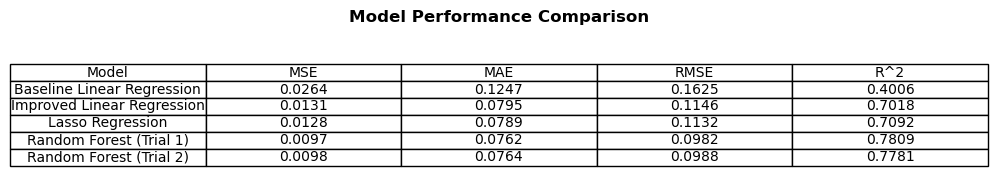
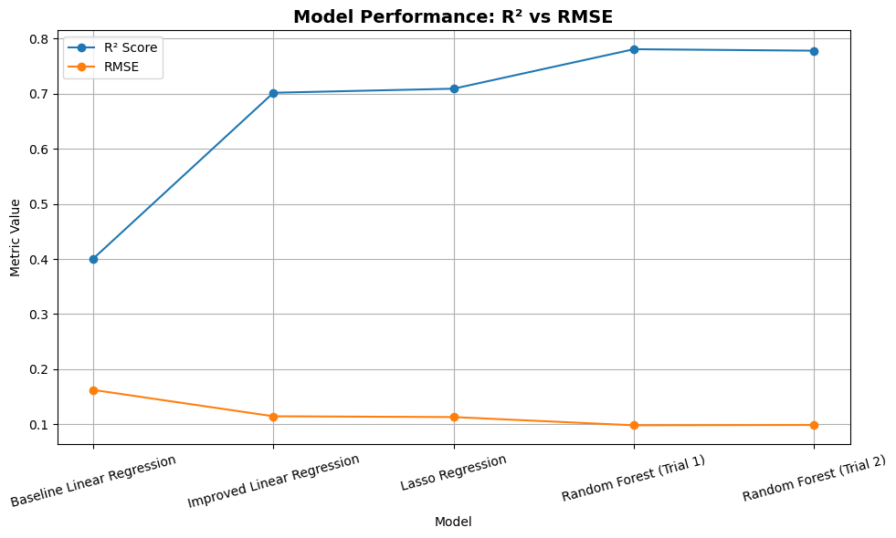

## Introduction

### Dataset Overview
This project uses the 2025 League of Legends (LoL) dataset from the Oracle's Elixir dataset (https://oracleselixir.com/tools/downloads), which tracks all pro games played throughout the year. Our dataset was downloaded on March 25, 2025, and only includes matches played before that date. It contains detailed team and player-level data from games across multiple competitive tiers and regional splits. Each match contains statistics such as champion picks, total gold, kills, side selection (blue/red), and game results.

Specifically, we chose the 2025 LoL data because it reflects the most up-to-date game meta and team rosters. Because the game evolves quickly with frequent updates to champion and item abilities, using the most recent data ensures our analysis captures the current competitive landscape, making the results more applicable for understanding the true features that impact team wins in the modern meta.

In this project, our analysis will address the key question **which features matter the most in determining team wins across a split?**
We will explore different elements that may affect the number of team wins, including: 
1. A specific side preference, blue or red
2. Champion diversity, calculated through variety in champion selection
3. and average kill-to-death ratio (KDR)

### Why does this matter?
Identifying features that influence team success provides insight into the strategic and performance-based factors that shape competitive e-sports. For example, a team's variety in champion selection (champion diversity) is heavily dependent on their coaching staff and the champion compositions they explore. On the other hand, the average KDR reflects the mechanical skills of the players and their time spent in training. By analyzing these features, we uncover trends that drive a team's success. This helps coaches, players, and administration make more informed decisions in scouting, preparation, and team development.

### Dataset Statistics
The dataset contains 24,373 rows of LoL match data, but we focus on the following columns that will help to answer our research question. 
- `gameid`: Unique identifier for each game
- `split`: The competitive split (e.g., Spring, Summer)
- `position`: The position the player played
- `side`: Team side (blue/red)
- `teamname`: Name of the team
- `teamid`: Unique team identifier
- `champion`: The player's selected champion
- `result`: Game outcome (1 for win, 0 for loss)
- `teamkills`: Number of team kills
- `teamdeaths`: Number of team deaths
- `damagetochampions`: Total damage dealt to champions
- `totalgold`: Total gold earned

## Data Cleaning
We performed the following data cleaning steps to ensure the dataset accurately reflects completed, competitive LoL games with meaningful information for analysis. 
1. **Removal of Incomplete Games**  
   We removed all rows where the `datacompleteness` field was not marked as `"complete"`. This ensures that only fully-played games' statistics are included in our analysis.
2. **Removal of Games with Unknown Teams**  
   Some entries involved teams labeled as `"unknown team"`, likely due to missing metadata or scraping issues. We identified all `gameid`s associated with these entries and removed all rows from those games to avoid partial or unbalanced comparisons.
3. **Selection of Relevant Columns**  
   For ease of later analysis steps, we selected the subset of columns relevant to our questions of interest:
   `['gameid', 'split', 'position', 'side', 'teamname', 'teamid', 'champion', 'result', 'teamkills', 'teamdeaths', 'damagetochampions', 'totalgold']`.
4. **Separation of Player-Level and Team-Level Data**  
   The dataset includes both team-specific and player-specific rows. For each game, there exists 5 rows per player and 1 row per team. With 2 teams, this is a total of (5+1)*2 = 12 rows of data. We split them into two separate DataFrames:
   - `team_df`: rows where `position == "team"`, representing overall team stats.
   - `player_df`: rows for specific player game choices, such as champion selection.
5. **Removal of Rows with Missing `split` Values**  
   After filtering for team-level rows, we found that all remaining `NaN` values were in the `split` column. Since the `split` indicates the tournament stage or league split the game belongs to (e.g., Spring or Summer), games without this information were excluded to avoid mixing in unstructured or potentially miscategorized matches. These rows were dropped using `dropna(subset="split")`.

Below is the head of the cleaned DataFrame:

| gameid           | split  | side | position | teamname  | teamid                                 | champion | result | teamkills | teamdeaths | damagetochampions | totalgold |
|------------------|--------|------|----------|-----------|----------------------------------------|----------|--------|-----------|-------------|--------------------|-----------|
| LOLTMNT03_179647 | Winter | Blue | top      | IZI Dream | oe:team:2799e04c7212d3c262467ef25427eda | Gnar     | 0      | 3         | 13          | 20156              | 10668     |
| LOLTMNT03_179647 | Winter | Blue | jng      | IZI Dream | oe:team:2799e04c7212d3c262467ef25427eda | Maokai   | 0      | 3         | 13          | 4963               | 7429      |
| LOLTMNT03_179647 | Winter | Blue | mid      | IZI Dream | oe:team:2799e04c7212d3c262467ef25427eda | Hwei     | 0      | 3         | 13          | 13952              | 9032      |
| LOLTMNT03_179647 | Winter | Blue | bot      | IZI Dream | oe:team:2799e04c7212d3c262467ef25427eda | Jinx     | 0      | 3         | 13          | 6898               | 9407      |
| LOLTMNT03_179647 | Winter | Blue | sup      | IZI Dream | oe:team:2799e04c7212d3c262467ef25427eda | Leona    | 0      | 3         | 13          | 4174               | 5719      |

Because of our filtering, we had no rows that contained `NaN` values, and did not need to perform imputation. So, after performing data cleaning, we retained a high-quality dataset of **3120 rows and 1560 games** for our analysis.

## Exploratory Analysis 

Early on, we explored questions such as: How do certain teams in Tier 1 pick their champions? Does a team's side (blue or red) influence their selection? And does the split (e.g., Spring vs. Summer) affect how teams build their compositions? These questions guided our early data aggregations and visualizations, where we examined champion diversity, side preference, and changes in team strategies across splits. 

### Winning Side Frequency (Univariate Analysis)
We first analyzed the overall winning side frequency across all games:
<iframe
  src="assets/winning_side.html"
  width="800"
  height="600"
  frameborder="0"
></iframe>
From our figure, we see that the blue side won 140 more games than the red side. This is interesting, as in LoL games, the blue side always has the first pick in champion selection. We know that side assignment is random in games, so should coaches have players play more scrims on the red side?

### Champion Selection by Side (Bivariate Analysis)
Next, to understand how the team side affected champion selection, we analyzed the distribution of the top 10 most picked champions by side (blue or red).
<iframe
  src="assets/champ_selection.html"
  width="800"
  height="600"
  frameborder="0"
></iframe>
Note that certain champions had a strong preference on one side. For example, Corki was picked 41 more times on the blue side than on the red, suggesting that it is valued as a first-pick option. This data could be used for champion bans, as players are aware of which champions their opponent is more likely to choose. 

### Interesting Aggregates

#### Average Total Gold by Side and Game Outcome

| Side | Loss       | Win        |
|------|------------|------------|
| Blue | 54,788.80  | 64,072.00  |
| Red  | 53,651.00  | 64,909.50  |

This table shows us that winning teams earn significantly more total gold than losing teams, regardless of whether they play on the red or blue side. The gap highlights the importance of strategies such as farming, securing objectives, and controlling the map. Thus, we can assume resource control is a critical factor in determining game outcomes in LoL -- so gold-related features might be useful in our predictive model.

#### Average Team Kills by Side and Game Outcome

| Side | Loss | Win  |
|------|------|------|
| Blue | 11.0 | 20.9 |
| Red  | 9.9  | 21.7 |

The "Average Team Kills by Side and Game Outcome" table shows a similar trend—winning teams secure up more kills,on average, than losing ones. This makes sense, as securing kills often leads to greater map control, gold income, and pressure. Note that this pattern holds true across both blue and red sides. So, kill-count-related features might also be useful in our model.

## Problem Identification
Thus, we aim to **predict the number of wins a LoL team will achieve during a split** using performance-based and strategic-based features. This is a regression problem because our target variable — the total number of wins per team per split — is a continuous number rather than a categorical label. We chose this target because win count is a direct indicator of a team performance across a season. The features used for prediction are:
- avrg_teamkills
- avrg_totalgold
- blue_ratio
- champion_diversity
- avrg_damagetochampions
- avg_kdr

All features are aggregated at the split level using data from previous splits. This way, they reflect team behavior and performance before the start of the split we’re predicting which simulates a real-world scenario. We want to forecast how well a team will perform in an upcoming split using only historical information and not provide any data from future games.

### Evaluation Metric
We use R² as our primary evaluation metric. This is because our primary goal is not just to predict win rate accurately, but to understand which features best explain a team’s performance over a split. R² directly measures how much of the variance in win rate is explained by the model, making it a more appropriate choice than MSE when interpretability and explanatory power are the focus. While MSE penalizes large errors and reflects raw prediction accuracy, it doesn’t tell us whether our model is learning meaningful patterns in the data. R², on the other hand, allows us to evaluate how well different feature sets and models capture the underlying structure of team success — which aligns more closely with our objective of identifying strategic factors that contribute to winning. By maximizing R², we prioritize models that offer clearer insights into what matters most for performance in competitive play.

## Baseline Model
We trained a baseline linear regression model to predict a team’s win rat in a given split.

### Features Used
We grouped the dataset by `teamname` and `split`, then computed average values per team per split to form these quantitative input features:
  - `avrg_teamkills`: Average number of kills per game.
  - `avrg_totalgold`: Average total gold earned per game.

The model includes 2 quantitative, 0 ordinal, and 0 nominal features. No encoding was necessary because all inputs were numeric. Note that the categorical variables of `split` and `teamname` were used only for grouping: they were not included as features in the model.

### Target Variable
The target variable was the **team’s win rate** across each split, calculated as:
`win_rate = number of wins / total number of games`.

### Model Training and Evaluation
We split the data into a 70/30 training/test split and trained a linear regression model using `scikit-learn`. Here are the performance metrics on the test set:

| Metric        | Value     |
|---------------|-----------|
| **MSE**       | 0.0264    |
| **MAE**       | 0.1247    |
| **R²**        | 0.401     |

We consider these results as a good starting point for modeling win rate considering we used just two stats. An R² of ~0.40 indicates that ~40% of the variance in win rate is explained by just two features, which is meaningful for such a high-variance outcome. Additionally, the low MAE (~12%) shows that predictions were generally close to the actual win rate, even with a simple model. The results also make intuitive sense: `teamkills` and `totalgold` are directly related to success in League of Legend. 

## Final Model
### Engineered Features
To improve on the baseline model, we added the following features, chosen based on their relevance to team strategy in competitive LoL matches:
- **`blue_ratio`**: The proportion of games played on the Blue side. The Blue side is traditionally seen as advantageous in pro play because it always gets first pick of champions. This ratio helps capture potential systemic advantages or preferences.
- **`champion_diversity`**: The number of unique champions a team played during a split. High diversity may indicate flexibility and strategic depth of a team, which could correlate with better performance.
- **`avrg_damagetochampions`**: The average damage dealt to champions. This statistic reflects heavily a team’s offensive capabilities.
- **`avg_kdr`**: The average kill-to-death ratio, calculated from `teamkills` and `teamdeaths`. A high KDR typically indicates team dominance during fights and good execution.

These features reflect a team's strategic style and adaptability, which go beyond raw metrics like kills and gold. Next, we trained four models to determine a one that would perform the best.

### 1. Linear Regression
For our first model, we used the same linear regression model in the baseline model with a preprocessing pipeline:
- **`avrg_teamkills` and `avrg_totalgold`** were scaled using StandardScaler to normalize their distribution.
- **`blue_ratio` and `avg_kdr`** were transformed using a QuantileTransformer to reduce skewness and account for outliers.
- **`champion_diversity` and `avrg_damagetochampions`** were left unscaled due to already reasonable distributions.

#### Model Performance

| Metric        | Baseline Model | Final Model |
|---------------|----------------|-------------|
| **MSE**       | 0.0264         | **0.0131**  |
| **MAE**       | 0.1247         | **0.0795**  |
| **R²**        | 0.401          | **0.702**   |
 
The R² improvement from 0.401 to 0.702 shows that our final model explains over 70% of the variance in win rate, compared to just 40% in the baseline. This is a significant improvement from our baseline model and shows that adding strategic features capture other aspects of the game that relate to its outcome. 

### 2. Lasso 
We chose to explore LASSO next because it can effectively perform feature selection and improve generalization/reduce overfitting. We chose to tune the alpha hyperparameter for our Lasso model. Since Lasso applies L1 regularization, adjusting alpha helps control model complexity. A higher alpha increases the regularization strength, reducing overfitting and potentially zeroing out unimportant features. We used `GridSearchCV` with 5-fold cross-validation to search across a range of alpha values: `[0.001, 0.01, 0.1, 1, 10]`. The optimal value was found to be: **`alpha = 0.001`**

#### Model Performance

| Metric        | Baseline Model | Final Model | Final Lasso |
|---------------|----------------|-------------|-------------|
| **MSE**       | 0.0264         |   0.0131    | **0.0128**  |
| **MAE**       | 0.1247         |   0.0795    | **0.0789**  |
| **R²**        | 0.401          |   0.702     | **0.709**   |
 

Compared to both the baseline and the earlier Linear Regression model, the Lasso model increased R² to 0.709, showing a stronger fit to the test data.

#### Feature Importance

Additionally, we examined the importance of each feature based on its learned coefficient values. The Lasso model applies L1 regularization, which leads to some coefficients being zeroed out, effectively performing feature selection. Features with non-zero coefficients have a stronger impact on predicting win rate, while those with near-zero coefficients were considered less important.

<iframe
  src="assets/lasso_importances.html"
  width="800"
  height="600"
  frameborder="0"
></iframe>
The following table lists the features ordered by their absolute coefficient values:

| Feature                | Coefficient |
|------------------------|-------------|
| `avg_kdr`              | 0.148017    |
| `avrg_totalgold`       | 0.068793    |
| `avrg_teamkills`       | 0.032144    |
| `blue_ratio`           | -0.019843   |
| `avrg_damagetochampions` | -0.000004 |
| `champion_diversity`   | 0.000000    |

From the table and plot, we can observe that **`avg_kdr`** has the largest positive coefficient, indicating it plays a significant role in the model's prediction of win rate. Conversely, **`champion_diversity`** has a coefficient of zero, meaning it was dropped by the Lasso regularization process - this metric is unimportant. 

### 3. Random Forest

For our final model, we selected a Random Forest Regressor due to its ability to model complex, non-linear relationships and handle interactions between features. We chose to tune `n_estimators`, `max_depth`, and `min_samples_split`, as these directly affect the complexity and performance of the model. We performed a grid search with 5-fold cross-validation to identify the best combination of these parameters, using **R²** as the scoring metric to maximize the proportion of variance explained by the model.
- **`n_estimators`**: The number of trees in the forest. We tested values of 100 and 200 to compare performance between a smaller, faster ensemble and a larger one with lower variance.
- **`max_depth`**: The maximum depth of each tree. Limiting depth can help prevent overfitting. We tested depths of `None` (no limit), 5, and 10.
- **`min_samples_split`**: The minimum number of samples required to split an internal node. Increasing this value can reduce overfitting by preventing the model from learning overly specific patterns.

#### Random Forest Trial 1

##### Best Hyperparameters:
- `n_estimators`: 100  
- `max_depth`: None  
- `min_samples_split`: 5  

##### Best Cross-Validation R² Score:
- **0.767** (on training data)

#### Final Model Performance (Test Set)

| Metric        | Value     |
|---------------|-----------|
| **MSE**       | 0.0097    |
| **MAE**       | 0.0762    |
| **R²**        | 0.781     |

The Random Forest model achieved an **R² score of 0.781**, indicating that it explains approximately **78%** of the variance in the target variable (win rate), and performs better than any of our earlier models.

### Random Forest Trial 2
In Trial 2, we refined our hyperparameter tuning by focusing on a more detailed set of values for `n_estimators`, `min_samples_split`, `max_features`, and `min_samples_leaf`. From Trial 1, we determined `max_depth` should remain at `None` to avoid overfitting.
- **`n_estimators`**: [100, 125, 150]  
- **`min_samples_split`**: [5, 6, 7]  
- **`max_features`**: [`'sqrt'`, `'log2'`, `None`]  
- **`min_samples_leaf`**: [1, 2, 3]

##### Best Hyperparameters:
- `n_estimators`: 125  
- `min_samples_split`: 5  
- `max_features`: None  
- `min_samples_leaf`: 1  

##### Best Cross-Validation R² Score:
- **0.769** (on training data)

#### Final Model Performance (Test Set)

| Metric        | Trial 1  | Trial 2  |
|---------------|----------|----------|
| **MSE**       | 0.0097   | 0.0098   |
| **MAE**       | 0.0762   | 0.0764   |
| **R²**        | 0.781    | 0.778    |

Despite a slightly better training cross-validation R² score (**0.769** vs **0.767**), the R² performance in Trial 2 (**0.778**) was marginally lower than Trial 1 (**0.781**). This suggests Trial 1 may generalize better, despite Trial 2 showing a stronger fit during training.

## Conclusion

### Model Performance Comparison
After evaluating multiple models, we selected the **Random Forest** model from **Trial 1** as our final model. Although Trial 2 offered a similarly strong fit, the Trial 1 Random Forest model achieved the **highest R² (0.781)** among all models, indicating that it generalizes best while capturing the most relevant relationships in the data.

### Feature Importance 
As a reminder, our original question was **Which features matter the most in determining team wins across a split?**

<iframe
  src="assets/final_feature_importance.html"
  width="800"
  height="600"
  frameborder="0"
></iframe>

Using the Random Forest (Trial 1) model, we find that **average KDR** is the most important predictor of a team’s win rate. It has an importance of 0.8605, compared to the next highest feature importance, `blue_ratio`, with a importance of 0.0475. 

Our work shows us that performance-based metrics such as KDR are more predictive of win rate than strategic elements like champion diversity or map side. This insight can guide analysts and teams in focusing on the most impactful aspects of play during a competitive split.